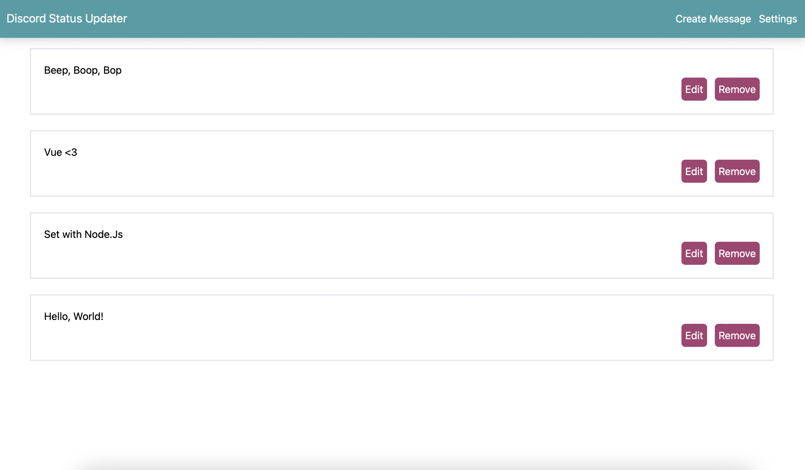

# discord-status-updater

Automatically update your Discord status from a list of messages on a set interval.

This program has 2 parts, the first part is a Nuxt/Vue application that allows users to store, create, edit, and delete messages. The second part is an Express server that runs a Cron job, this Cron job will run on an interval based on your enviroment variables. It will then launch a puppeteer process, that logins into your discord, solves the CAPTCHA if needed, and then changes your status to a message it picks randomly from the list the user created.



The Vue webpage is protected by a password you set in the enviroment variables, you will need to enter this password to change or add any messages, you will then be sent a httpOnly cookie with a JWT token attached used to authenticate, this token is valid for 24 hours.

## Screenshots

Here is the discord automation in action. (Note this is with headless mode off, this will normally run silently in the background)


Login Page


Edit Page


Create Page


## Installation

Note: The LTS version of Node is recommended.

First you must create 2 files on the root directory of the project, the first is the enviroment variables, this file should be called ".env".

Add the following key value pairs to the file.

(Login password is what you need to type into the Vue webUI in order to change messages.

- LOGIN_PASSWORD=

(JWT password is the key used to sign JWTs)

- JWT_PASSWORD=

(Cron time is the interval you want the discord automation to run at)

- CRON_TIME=

(Email is the email of your discord account)

- email=

(Discord password is your discord account password, NOTE it is NOT RECOMMENDED to store your discord password in an env file, if this key is not provided, the server will instead ask for the password through the terminal which is only stored in memory and is much safer. ONLY STORE YOUR DISCORD PASSWORD IN THE ENV FILE IS YOU 100% HAVE TOO)

- DISCORD_PASSWORD=

(Captcha api key, this is optional, you can just manually enter the captcha if you want, you should only need to do it once. Or you can get a key here https://2captcha.com/enterpage )

- CAPTCHA_API_TOKEN=

The secound file you must add is the 'db.json' file, again create this on the root directory, and just make its contents an empty JSON object.

>Install Node Modules
``` javascript
npm install
```
>Build the project
``` javascript
npm run build
```

>Run the project
``` javascript
npm run start
```

The server should run at http://localhost:3000 by default, navigate to this URL to access the web UI.
